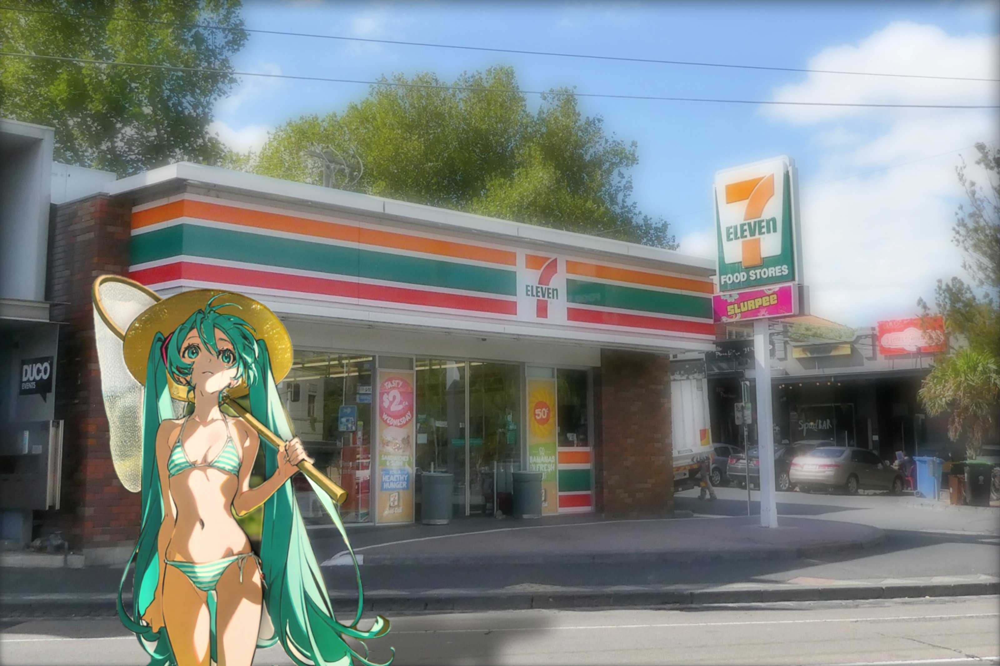
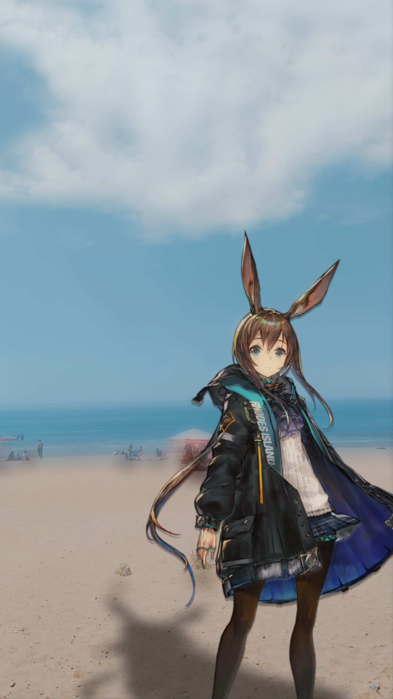
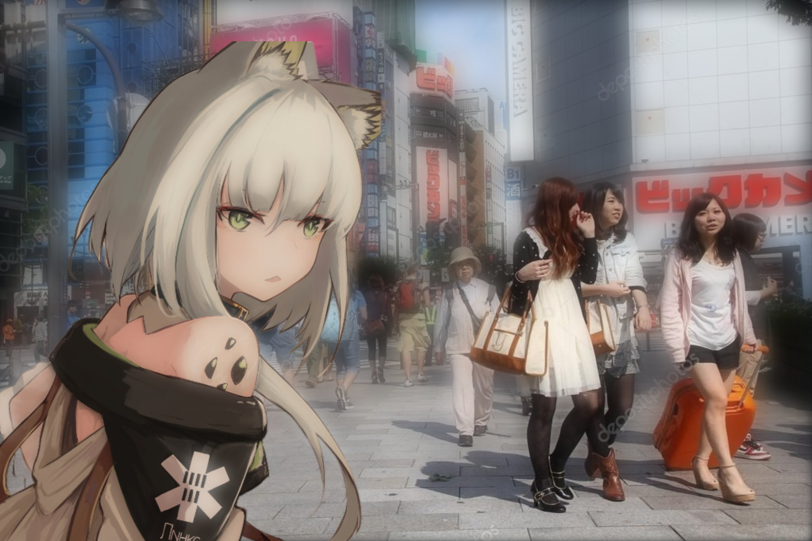

# 溶图 · Anime‑into‑Photo Relight Compositor

[简体中文](./README.md) | **English**

Composite 2D anime characters into real photos — keep the flat anime art, make only the **light & shadow** physically believable. CPU‑only backend preprocessing + real‑time WebGL relighting in the browser, with an Apple‑style control panel.

  



| | |
|---|---|
|  |  |

---

## Features

- **Matting** — ToonOut (BiRefNet fine‑tuned for anime, soft alpha); already‑transparent inputs use their own alpha.
- **Relighting (real‑time)** — Lambert diffuse + light‑side highlight + back‑side darkening + exposure/tint grade.
- **AO self‑shadow**, **rim light**, **environment color bleed** (character edges pick up local background color).
- **Silhouette ground shadow** — squashed & sheared by light direction; **draggable**, with length / angle / strength / foot‑line / on‑off controls.
- **Depth‑aware DOF** — unified depth field, aperture‑style blur (0 = off, up to strong bokeh), clean non‑darkened edges.
- **Depth occlusion** (foreground objects cover the character), **edge feather** (silhouette only, interior stays crisp), **bloom**.
- **Interaction** — drag character / drag shadow / wheel zoom / light puck; canvas auto‑fits any aspect ratio + 2× supersampling.
- **Control panel** — Apple frosted‑glass; live sliders for everything; dynamic character dropdown; upload character/scene (with loading spinner).

## Component choices

| Stage | Choice | Notes |
|---|---|---|
| Matting | **ToonOut** (`joelseytre/toonout`, anime‑tuned BiRefNet) | Best on hair / mesh / semi‑transparency, MIT, GPU |
| Matting (CPU fallback) | `rembg` isnet‑anime / birefnet‑general | Used by the upload endpoint, CPU‑only |
| Character normals / AO | Depth‑Anything‑v2‑small depth → normals + cavity AO | ONNX, CPU |
| Scene light direction | OpenCV ground‑region luminance centroid | Zero‑model; puck overrides |
| Scene depth | Depth‑Anything‑v2‑small ONNX | DOF + occlusion |
| Renderer | PixiJS v8 + hand‑written GLSL | WebGL, vendored, zero build step |

## Setup (miniconda)

```bash
# 1) Serving + inference (CPU only)
conda create -n relight -c conda-forge python=3.10 -y
conda run -n relight python -m ensurepip --upgrade
conda run -n relight pip install fastapi "uvicorn[standard]" python-multipart \
    onnxruntime rembg opencv-python-headless numpy pillow playwright huggingface_hub
conda run -n relight playwright install chromium      # for demo / screenshot tools

# 2) High-quality matting (ToonOut, needs a GPU; optional)
conda create -n relightgen -c conda-forge python=3.10 -y
conda run -n relightgen python -m ensurepip --upgrade
conda run -n relightgen pip install torch torchvision --index-url https://download.pytorch.org/whl/cu128
conda run -n relightgen pip install transformers einops timm pillow opencv-python-headless huggingface_hub
```

> **Model weights are not in the repo** (Depth‑Anything ≈ 99 MB, over GitHub's 100 MB limit). They auto‑download from HuggingFace on first run of `estimate_depth.py` / `make_normals.py`; ToonOut and rembg weights download on first use too.

## Run

```bash
./run.sh
# or: conda run -n relight uvicorn app:app --app-dir backend --host 127.0.0.1 --port 8000
# open http://127.0.0.1:8000/?char=<name>
```

## Add a character / scene

The repo ships no copyrighted source art or generated assets. Bring your own images, then:

```bash
# Character (high quality, ToonOut, GPU):
conda run -n relightgen python backend/matte_anime.py inputs/your_char.png --name name
conda run -n relight   python backend/make_normals.py --name name
# or CPU-only one-shot (slightly lower quality):
conda run -n relight   python backend/prep_character.py inputs/your_char.png --name name

# Scene:
conda run -n relight python backend/estimate_light.py --scene inputs/your_scene.jpg
conda run -n relight python backend/estimate_depth.py --scene inputs/your_scene.jpg
```

The panel's **Upload character / Upload scene** buttons do all of this from the browser (with a loading spinner).

## Control panel

- **Drag character** = move · **Drag shadow** = move shadow only · **Wheel** = scale · **Light puck** = light direction
- Lighting: key / ambient / exposure / highlight / back‑shade
- Realism: AO · rim · env‑bleed · shadow opacity · foot‑line · shadow length · shadow angle · aperture (DOF) · bloom · edge feather
- Toggles: shadow · occlusion · DOF · bloom · depth‑scale

## Layout

```
backend/   app.py (FastAPI: static host + upload pipeline) · matte_anime.py (ToonOut)
           prep_character / make_normals / estimate_light / estimate_depth / preview_composite / imgio
           devtools/ (shoot · dragtest · ui_shot · make_demo) · experimental/ (abandoned img2img)
web/public/ index.html · app.js · vendor/ (PixiJS, interact.js)
inputs/    source images (gitignored)   out/ generated (gitignored)   demo/ showcase
```

## Limitations

- "Semi‑realistic" means **realistic light, 2D character preserved**. An img2img attempt that turned the character into a real human (`experimental/`) was abandoned.
- Character normals are a depth approximation; the light‑direction estimate is ambiguous (puck overrides); the silhouette shadow is a screen‑space projection you tune by hand, not a physical ray trace.
- The upload endpoint uses CPU `rembg`; for the best hair quality use the GPU `matte_anime.py` (ToonOut).

## Credits & License

Anime characters shown in the demos (Arknights, Hatsune Miku, EVA, …) are property of their respective owners; this project is for **technical demonstration / learning** only and does not distribute source character art. Models & libraries (ToonOut/BiRefNet, Depth‑Anything‑v2, rembg, PixiJS, FastAPI) follow their own licenses.

**Code released under the MIT License.**
